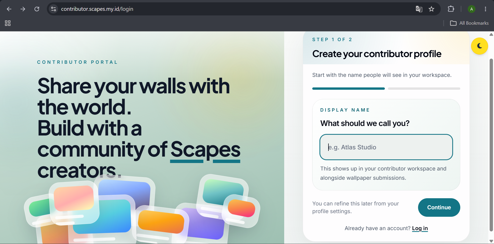
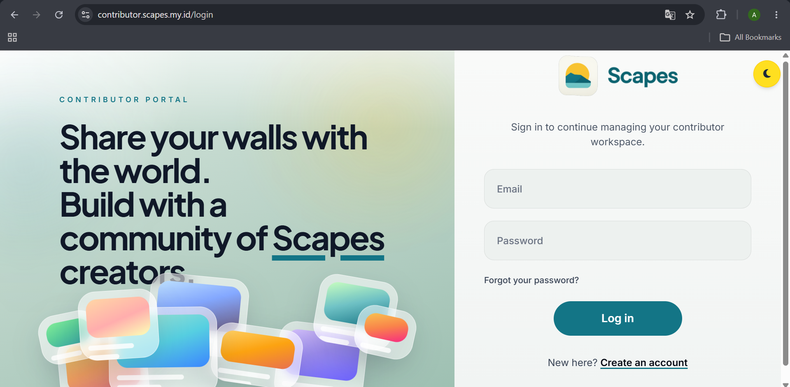
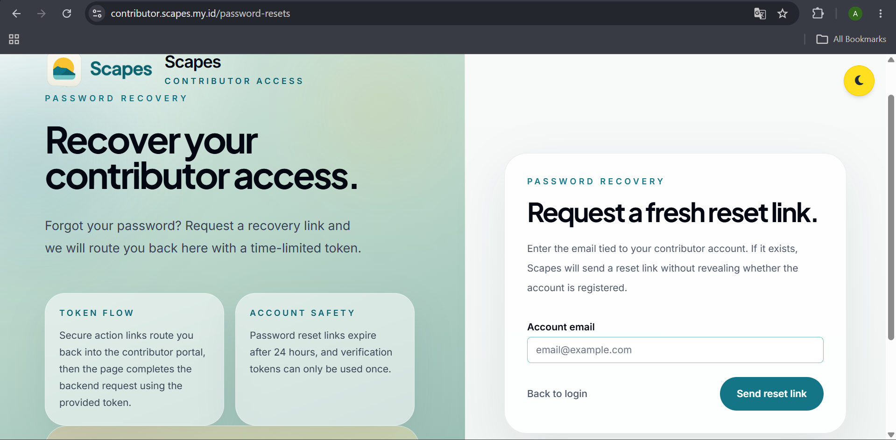
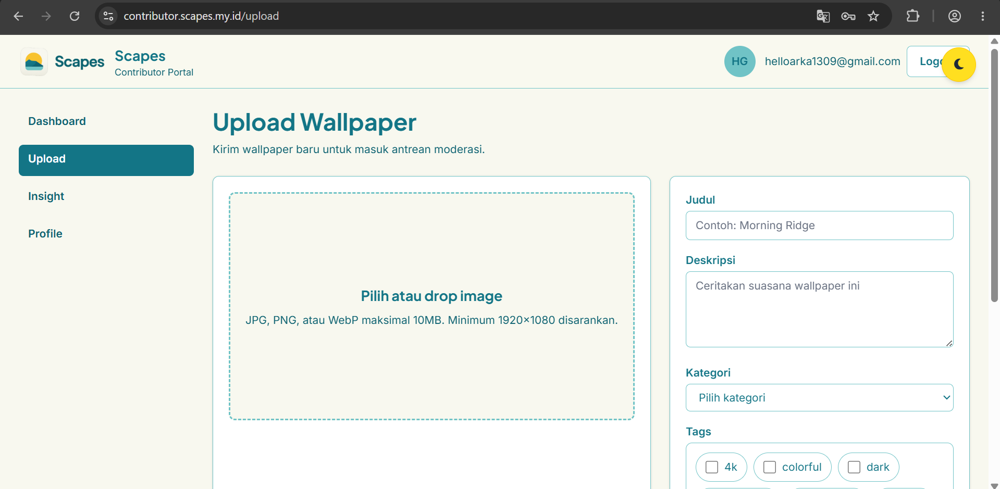
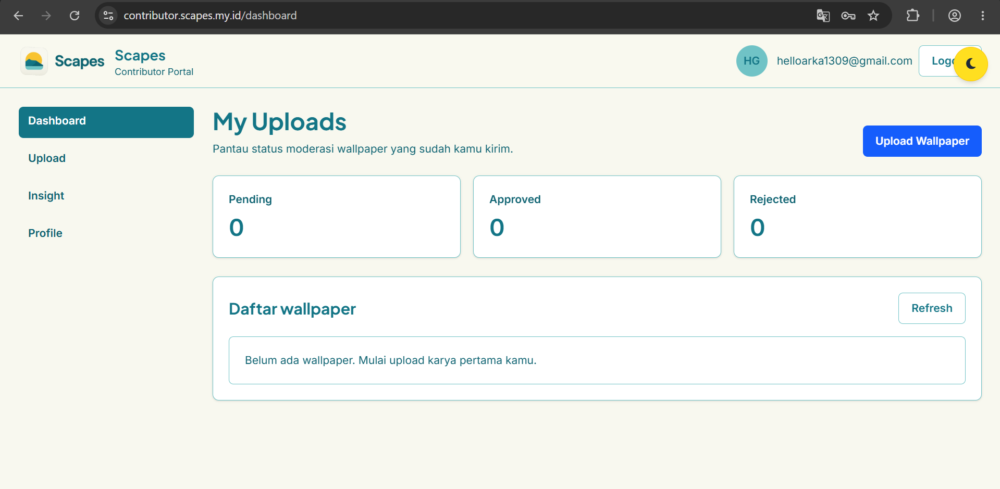
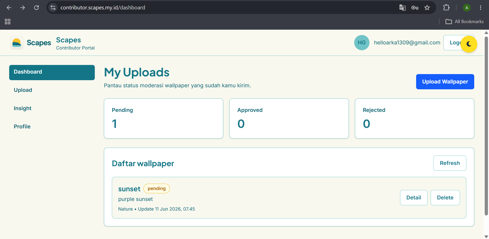
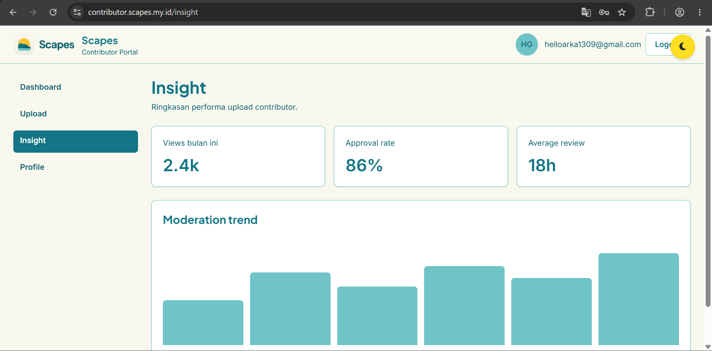
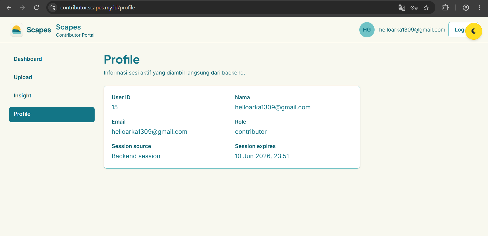
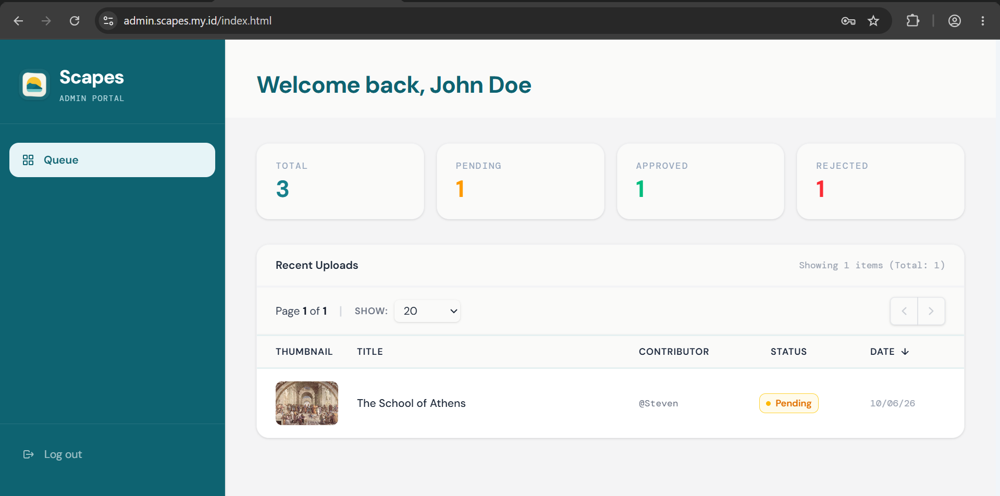
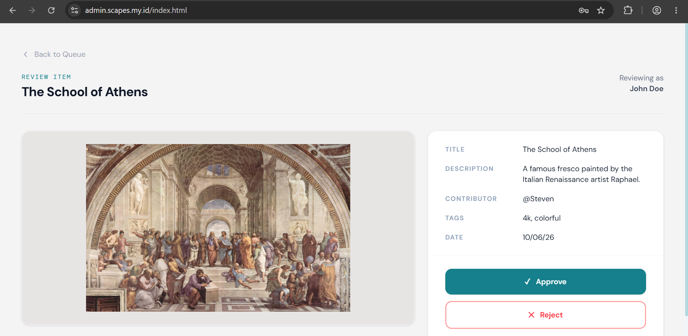

# Scapes - Wallpaper Browser & Setter

Scapes adalah aplikasi desktop yang memungkinkan pengguna menelusuri, mengunduh, dan menerapkan wallpaper langsung dari internet tanpa perlu membuka browser. Dengan satu klik, wallpaper bisa langsung terpasang di desktop. Aplikasi ini juga menyediakan manajemen folder otomatis untuk menghindari penumpukan file di direktori unduhan.

## Anggota Kelompok

| Nama Lengkap                | NIM        | Role                   |
|-----------------------------|------------|------------------------|
| Alifa Fitra Faiha           | L0124036   | Support Developer & QA |
| Allia Nur Shafira           | L0124037   | Front-End & Desain   |
| Bintang A'raaf Stevan Putra | L0124091   | Lead Developer         |
| Allyssa Hatitya Pratiwi     | L0124146   | Documentation & QA    |

## Fitur Utama

1. **Scapes Contributor Portal (Register akun)** - Contributor dapat membuat akun baru dengan mengisi data diri dan melakukan verifikasi melalui email. 
2. **Scapes Contributor Portal (Login/Logout)** - Contributor dapat masuk ke portal menggunakan email dan password, serta keluar dari sesi secara aman. 
3. **Scapes Contributor Portal (Reset Password)** - Contributor dapat mengatur ulang password melalui tautan yang dikirimkan ke email terdaftar. 
4. **Scapes Contributor Portal (Upload wallpaper)** - Contributor dapat mengunggah wallpaper dengan format JPG, PNG, atau WebP (maks. 10 MB, resolusi minimal 1920×1080).
5. **Scapes Contributor Portal (Lacak status moderasi)** - Contributor dapat memantau status moderasi setiap wallpaper yang diunggah (pending, approved, atau rejected). 
6. **Scapes Contributor Portal (Delete wallpaper)** - Contributor dapat menghapus wallpaper miliknya secara permanen dari sistem. 
7. **Scapes Contributor Portal (Insight)** - Contributor dapat melihat statistik performa wallpaper miliknya, seperti jumlah tayangan dan unduhan.
8. **Scapes Contributor Portal (Profile)** - Contributor dapat melihat informasi mengenai profile. 
9. **Scapes Admin Portal (Dashboard)** - Admin dapat melihat ringkasan aktivitas platform, termasuk jumlah wallpaper pending, approved, dan rejected. 
10. **Scapes Admin Portal (Review wallpaper)** -  Admin dapat meninjau wallpaper yang dikirimkan oleh contributor, kemudian memberikan keputusan approve atau reject beserta alasannya. 

## Tech Stack

- Java
- PHP

## Cara Instalasi dan Menjalankan

1. Buka browser (Chrome 90+, Firefox 88+, Edge 90+)
2. Kunjungi URL berikut:
    - Contributor: https://contributor.scapes.my.id	
    - Admin: https://admin.scapes.my.id

## Screenshot

1. **Scapes Contributor Portal (Register akun)** 
    
2. **Scapes Contributor Portal (Login/Logout)** 
    
3. **Scapes Contributor Portal (Reset Password)** 
    
4. **Scapes Contributor Portal (Upload wallpaper)** 
    
5. **Scapes Contributor Portal (Lacak status moderasi)** 
    
6. **Scapes Contributor Portal (Delete wallpaper)** 
    
7. **Scapes Contributor Portal (Insight)**
    
8. **Scapes Contributor Portal (Profile)** 
    
9. **Scapes Admin Portal (Dashboard)** 
    
10. **Scapes Admin Portal (Review wallpaper)** 
    