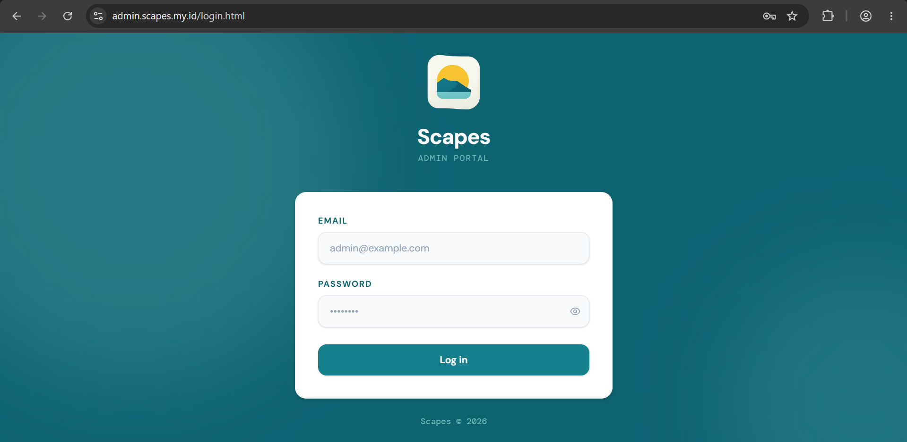

# Panduan Pengguna Scapes

Scapes adalah ekosistem wallpaper yang terdiri dari tiga platform:

| Platform | Untuk siapa? | Fungsinya |
|---|---|---|
| **Aplikasi Scapes** (Windows & Android) | Pengguna umum | Mencari, mengunduh, dan langsung memasang wallpaper |
| **Portal Kontributor** (web) | Kontributor gambar | Mengunggah wallpaper untuk direview tim Scapes |
| **Portal Admin** (web) | Admin/moderator | Meninjau dan menyetujui/menolak wallpaper yang diunggah kontributor |

Panduan ini menjelaskan cara memakai ketiga platform tersebut langkah demi langkah, dengan bahasa yang sederhana agar mudah diikuti siapa saja.

> **Catatan:** Gambar pada panduan ini ada yang berupa *placeholder* (belum berupa tangkapan layar asli). Placeholder ditandai dengan keterangan "*(screenshot menyusul)*" dan perlu diganti dengan tangkapan layar sungguhan sebelum dipublikasikan.

## Daftar Isi

1. [Portal Kontributor](#1-portal-kontributor)
2. [Portal Admin](#2-portal-admin)
3. [Aplikasi Scapes (Desktop & Android)](#3-aplikasi-scapes-desktop--android)
4. [Tanya Jawab Singkat (FAQ)](#4-tanya-jawab-singkat-faq)

---

## 1. Portal Kontributor

Portal Kontributor digunakan untuk mengunggah wallpaper hasil karya kamu agar bisa tampil di Aplikasi Scapes setelah disetujui admin.

🔗 Akses di: `contributor.scapes.my.id`

### 1.1 Daftar Akun Baru

1. Buka halaman login, lalu pilih tab/tautan **Daftar (Register)**.
2. Isi nama tampilan, alamat email, kata sandi, dan konfirmasi kata sandi.
3. Centang kotak persetujuan hak cipta/ketentuan yang tersedia.
4. Klik **Daftar**.
5. Buka email kamu dan klik tautan verifikasi yang dikirim Scapes untuk mengaktifkan akun.

> Tanpa verifikasi email, akun belum bisa digunakan untuk login.

### 1.2 Login

1. Buka halaman login portal kontributor.
2. Masukkan email dan kata sandi.
3. Klik **Login**. Kamu akan diarahkan ke halaman **Dashboard**.

### 1.3 Lupa Kata Sandi

1. Di halaman login, klik **Lupa kata sandi?**.
2. Masukkan email akun kamu, lalu klik kirim.
3. Cek email untuk tautan reset kata sandi, klik tautan tersebut.
4. Masukkan kata sandi baru dan simpan.

### 1.4 Mengunggah Wallpaper

1. Dari Dashboard, klik menu **Upload**.
2. Seret (drag-and-drop) file gambar ke kotak unggah, atau klik untuk memilih file dari komputer.
   - Format yang didukung: JPG, PNG, WebP.
   - Ukuran maksimal 10 MB, resolusi minimal 1920×1080.
3. Isi **Judul**, **Deskripsi**, pilih **Kategori**, serta tambahkan **Tag** yang relevan.
4. Pilih jenis perangkat yang cocok untuk wallpaper tersebut (Desktop/Mobile/Tablet).
5. Centang dua pernyataan wajib:
   - Gambar tidak mengandung unsur kekerasan/pornografi/simbol kebencian.
   - Kamu memiliki hak untuk mendistribusikan gambar tersebut.
6. Klik **Submit for Review** untuk mengirim wallpaper ke antrian moderasi admin.

### 1.5 Memantau Status Moderasi

Setiap wallpaper yang diunggah akan berstatus salah satu dari:

- **Pending** — masih menunggu ditinjau admin.
- **Approved** — disetujui dan sudah tampil di Aplikasi Scapes.
- **Rejected** — ditolak, lengkap dengan alasan penolakan dari admin.

Buka menu **Dashboard (My Uploads)** untuk melihat ringkasan jumlah wallpaper di tiap status, serta memfilter berdasarkan status atau kategori. Klik salah satu wallpaper untuk melihat detail; jika ditolak, alasan penolakan akan ditampilkan di halaman detail tersebut.

### 1.6 Menghapus Wallpaper

1. Di halaman Dashboard, cari wallpaper yang ingin dihapus.
2. Klik ikon/tombol **Hapus**.
3. Konfirmasi penghapusan pada dialog yang muncul.

### 1.7 Insight Kontributor

Menu **Insight** menampilkan statistik seperti total views, approval rate, dan waktu review.

> **Catatan:** Fitur ini masih dalam tahap pengembangan (ditandai "still in progress" pada aplikasi) dan saat ini hanya menampilkan pratinjau blur/contoh tampilan. Fungsinya sepenuhnya belum aktif.

### 1.8 Profil

Menu **Profile** menampilkan nama, email, dan informasi sesi login kamu.

> **Catatan:** Saat ini halaman profil bersifat baca-saja (belum ada form untuk mengubah data).

### 1.9 Logout

Klik menu **Logout** pada sidebar untuk keluar dari akun.

---

## 2. Portal Admin

Portal Admin digunakan tim moderator untuk meninjau wallpaper yang diunggah kontributor sebelum tampil di Aplikasi Scapes.

🔗 Akses di: `admin.scapes.my.id`

### 2.1 Login Admin

1. Buka halaman login admin.
2. Masukkan email dan kata sandi admin.
3. Klik **Login**. Kamu akan diarahkan ke halaman **Dashboard/Antrian**.

### 2.2 Dashboard Antrian Moderasi

Halaman utama menampilkan:

- Sapaan selamat datang dengan nama admin yang login.
- 4 kartu ringkasan: **Total**, **Pending**, **Approved**, **Rejected** — klik salah satu kartu untuk memfilter tabel sesuai status.
- Tabel **Recent Uploads** berisi thumbnail, judul, nama kontributor, status, dan tanggal unggah.
- Bisa diurutkan berdasarkan tanggal (klik header kolom **Date**).
- Navigasi halaman (pagination) dengan pilihan jumlah baris per halaman: 20/50/75/100.

### 2.3 Meninjau dan Memutuskan Wallpaper

1. Klik salah satu baris pada tabel **Recent Uploads** untuk membuka halaman **Review**.
2. Periksa pratinjau gambar penuh, judul, deskripsi, nama kontributor, tag, dan tanggal unggah.
3. Pilih salah satu tindakan:
   - **Approve** — menyetujui wallpaper agar tampil di Aplikasi Scapes.
   - **Reject** — menolak wallpaper. Kamu **wajib** mengisi alasan penolakan pada dialog konfirmasi yang muncul; alasan ini akan ditampilkan kepada kontributor.
4. Konfirmasi tindakan pada dialog yang muncul.
5. Klik **Back to Queue** untuk kembali ke daftar antrian (data akan otomatis diperbarui).

### 2.4 Logout

Klik tombol **Logout** pada sidebar untuk keluar dari sesi admin.

---

## 3. Aplikasi Scapes (Desktop & Android)

Aplikasi Scapes adalah aplikasi untuk pengguna umum yang ingin mencari dan memasang wallpaper. Tersedia untuk **Windows (Desktop)** dan **Android**, tanpa perlu login/akun.

🔗 Unduh di: `scapes.my.id`

### 3.1 Memasang Aplikasi

- **Windows:** unduh installer (`.exe`/`.msi`) dari situs resmi, jalankan, lalu ikuti proses instalasi. Shortcut akan otomatis dibuat di Start Menu/Desktop.
- **Android:** unduh dan pasang APK/dari Play Store (sesuai kanal distribusi resmi), lalu buka aplikasinya.

### 3.2 Menjelajah Wallpaper (Beranda)

Halaman **Beranda** menampilkan carousel wallpaper unggulan ("Featured 🔥") serta wallpaper berdasarkan kategori. Gulir ke bawah untuk memuat lebih banyak wallpaper.

- **Desktop:** navigasi menggunakan sidebar/drawer di samping.
- **Android:** navigasi menggunakan bottom navigation bar, wallpaper ditampilkan dalam grid 2 kolom (staggered grid), dan bisa tarik ke bawah (pull-to-refresh) untuk menyegarkan daftar.

### 3.3 Mencari Wallpaper

1. Klik/ketuk kolom pencarian.
2. Ketik kata kunci — akan muncul saran/tag otomatis saat kamu mengetik.
3. Tekan Enter atau pilih salah satu saran untuk melihat hasil pencarian.
4. Gunakan tab kategori untuk mempersempit hasil.

Kamu juga bisa mengganti **sumber gambar** (Scapes, Pexels, Unsplash, atau Pixabay) melalui menu Pengaturan (lihat bagian 3.6).

### 3.4 Mengunduh dan Memasang Wallpaper

Pada setiap gambar wallpaper, arahkan kursor (desktop) atau ketuk (Android) untuk memunculkan opsi:

- **Save/Download** — menyimpan gambar ke Koleksi. Setelah tersimpan, ikon berubah menjadi ikon **Hapus**.
- **Apply** — langsung menerapkan gambar sebagai wallpaper. Proses ditandai indikator loading, lalu notifikasi (snackbar di desktop, toast di Android) menunjukkan berhasil/gagal.

**Khusus Android**, sebelum menerapkan wallpaper kamu bisa:
- Melihat pratinjau layar penuh terlebih dahulu.
- Memilih menerapkan ke **layar utama (home)**, **layar kunci (lock screen)**, atau **keduanya**.
- Membagikan (share) wallpaper ke media sosial.

> Saat pertama kali memasang wallpaper di Android, aplikasi akan meminta izin (permission) yang perlu kamu setujui.

### 3.5 Koleksi

Menu **Collections** menyimpan semua wallpaper yang sudah kamu unduh, agar mudah diakses kembali tanpa perlu koneksi internet. Kamu bisa menghapus wallpaper dari koleksi kapan saja.

### 3.6 Pengaturan

Menu **Settings** memungkinkan kamu mengatur:

- **Tema** — beralih antara mode terang dan gelap.
- **Sumber gambar** — mengaktifkan/menonaktifkan sumber (Scapes/Pexels/Unsplash/Pixabay) dan memasukkan API key pribadi (opsional; jika kosong, aplikasi memakai key bawaan).
- **Folder unduhan** *(khusus Desktop)* — memilih lokasi penyimpanan file wallpaper yang diunduh.

---

## 4. Tanya Jawab Singkat (FAQ)

**Wallpaper saya berstatus Pending terus, kenapa?**
Wallpaper akan berubah status setelah ditinjau oleh admin melalui Portal Admin. Waktu peninjauan bisa bervariasi tergantung antrian.

**Wallpaper saya ditolak, apa yang harus dilakukan?**
Buka halaman detail wallpaper di Portal Kontributor untuk membaca alasan penolakan dari admin, lalu unggah ulang dengan perbaikan sesuai catatan tersebut.

**Apakah perlu login untuk memakai Aplikasi Scapes (bukan portal kontributor/admin)?**
Tidak. Aplikasi Scapes untuk pengguna umum tidak memerlukan akun/login.

**Kenapa hasil pencarian di beberapa sumber gambar tidak muncul?**
Pastikan sumber tersebut diaktifkan di menu Pengaturan, dan jika kamu memasukkan API key sendiri, pastikan key tersebut valid.
